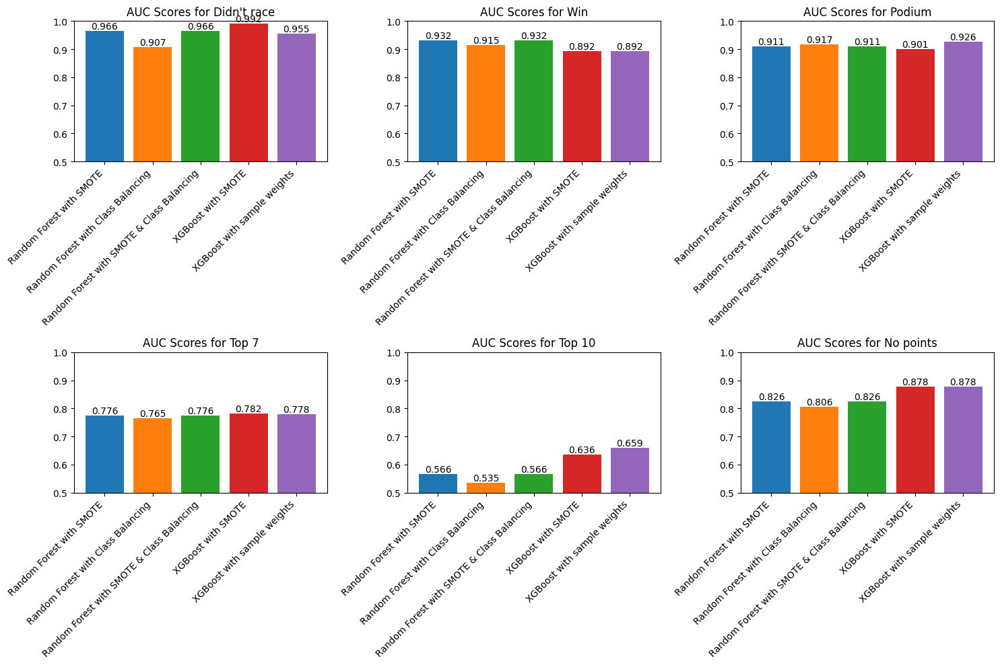
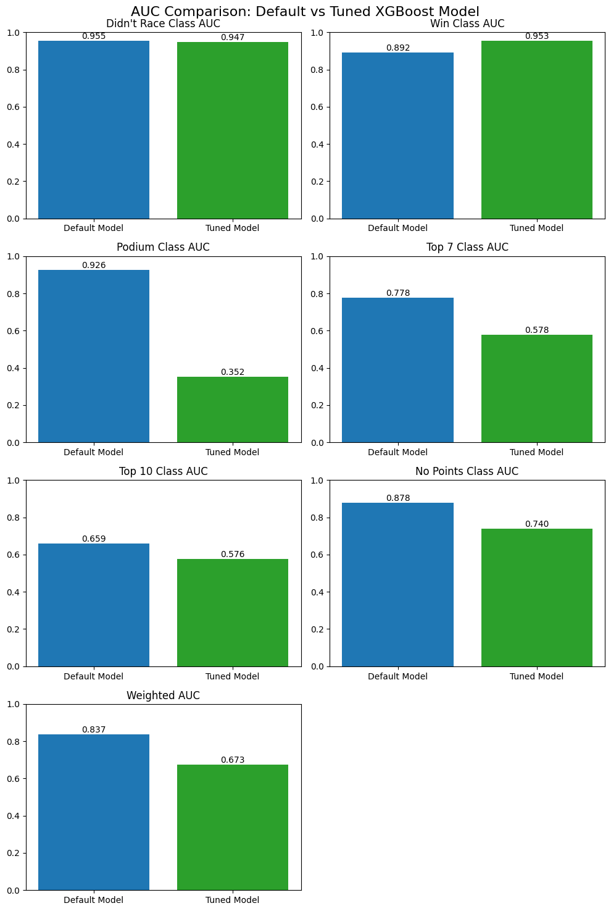

# Formula1 predictive modeling

Sports, especially motorsports, is heavily driven by data and analytics behind the scenes. As a viewer of Formula 1, I wanted to apply my skills and experience with machine learning models to a sport that I enjoyed watching and had knowledge in. As my first foray into this domain, I wanted to build a model to make predictions on the race results of drivers using past session results and weather data. There are two approaches for such a problem: Regression and classification. To predict the exact finishing position, a regression model would be much more suitable, however, I wanted to classify drivers into common buckets used to look at Grand Prix results, which meant that a classification model would be more suitable.

### The data

The dataset used in this project was compiled using the [OpenF1 API](https://openf1.org/url). I pulled session data from every Grand Prix weekend as well as PreSeason testing from 2022 to the present, due to the regulations being mostly similar during this period (ground effect era). For each session, I retained weather features and finishing positions for all drivers, including substitutions. I also included the team of each driver as well. To get this data, I wrote a short Python script (data_scraping.py) to scrape train/test data from the OpenF1 API for a set date range and data for the latest race weekend that we want to make predictions on.

### Model Exploration

There are two approaches for such a problem: Regression and classification. To predict the exact finishing position (eg 1-20), a regression model would be much more suitable, however, I wanted to classify drivers into common buckets used to look at Grand Prix results, which meant that a classification model would be more suitable. I wanted to classify the drivers' finishing position into the following classes: Winner, P2-P3, P4-P7 finish, P8-P10 (top 10 finish), and no points (all other finishing positions). However, this introduced one of the most common issues in ML problems: class imbalances. Since every race only has one winner, two drivers in P2/P3, etc, the classes are severly imbalanced. Some classification models such as Random Forest offer features to balance the class weights, which could be an option. Utilizing a resampling step in the pipeline would also be a viable solution. \
\
Two common classification models used in sports predictions are Random Forest and XGBoost. To see which would be more suitable for my dataset, I trained five models: Random Forest with a SMOTE resampling step, Random Forest with balanced class weights, Random Forest with both SMOTE and balanced class weights, XGBoost with SMOTE, and XGBoost with sample weights (which requires weights computed seperately). Since the classes are quite imbalanced, I opted to measure model performance using the area under the ROC curve (AUC). The class "Didn't Race" is also included for drivers that participated in FPs but not the Race itself.

As we can see in the figure, all models tested scored near perfect for the "Didn't race" class, which makes sense since a signed driver that was present for previous sessions rarely misses a race. For the "Win" class, the Random Forest models all outperformed the XGBoost models, though not by much (0.932 for the SMOTE Random Forest vs 0.892 for both XGBoost models). For the "Podium" class, all models performed very close to each other in the 0.9 - 0.91 range. All five models also were quite close for the "Top 7" class, in the 0.76-0.78 range. However, for the "Top 10" class, the XGBoost models both dominated the Random Forest models, with the sample weighted model having the highest AUC score of 0.659. Finally, for the "No points" class, both XGBoost models performed better than the Random Forest models, both with scores of 0.878. All models seemed to have the worst AUC score in the "Top 10" class. This makes sense since Formula 1, as a motorsport, is notorious for having distinct "classes" of teams (top teams/ championship contenders, midfield, and backmarkers), with the midfield always being extremely competitive and unpredictable. On the other hand, top positions are typically very consistent from qualifying position, since seasons with top teams (Mclaren, Mercedes, Ferrari, etc.) all competing for wins is rare. Ultimately, I selected the XGBoost model with sample weights since it performed the best in the most difficult class (Top 10).

### Hyperparameter Tuning

Next, I utilized hyperopt (using this [Kaggle Guide](https://www.kaggle.com/code/prashant111/a-guide-on-xgboost-hyperparameters-tuning)) to tune my XGBoost model. I explored different max_depth, gamma, regularization values, and min_child_weights to find tune the model. However, ultimately, the tuned model didn't perform as well as the model with default parameters (which could be due to factors such as overfitting or limited data size).

